# ListaIsto.

A collaborative shopping list web application with a **Rust** (Axum) backend, a
**React + TypeScript** (Vite) single-page frontend, a **MariaDB** database,
containerized with **Docker Compose** and served via **Caddy** with automatic
HTTPS.

---

## Description

**ListaIsto.** is a shopping list management app with two sections per list:

- **Pantry** (*Despensa*) — items available at home
- **To Buy** (*A comprar*) — items marked for purchase

### Features

- **Multiple lists** — create, delete, and switch between lists
- **List sharing** — share a list with another registered user for collaboration
- **Link sharing** — generate temporary public links with granular permissions
  (add, edit, delete, toggle) and an expiry date
- **Public link view** — open a shared link without an account; logged-in users
  can stash the shared list into their own collection
- **Add items** with name and quantity (default: `1`)
- **Edit** name and quantity, **delete** with confirmation
- **Toggle** — checking a pantry item moves it to "To Buy" and back
- **Quantity stepper** — increment/decrement numeric quantities
- **Search / autocomplete** — suggestions across the user's lists
- **Race-condition safe** — toggles send an explicit destination, so concurrent
  clicks are idempotent
- **Authentication** — registration, login, change password
- **Email association** — users without an email are asked once for one; it is
  stored in the app-owned `user_email` table
- **Password recovery by email** — single-use, 1-hour reset link sent via SMTP
- **Dark-mode** UI, optimized for mobile
- **PWA support** — installable with icons and manifest

---

## Architecture

```
Browser ──HTTPS──▶ Caddy ─┬─ /api/*  ──reverse_proxy──▶ Rust backend (axum, :8766)
                          └─ /*      ── serves the React SPA (static files)
                                          Rust ──sqlx──▶ MariaDB (:3306)
```

- **frontend/** — React + TypeScript + Vite SPA. Built to `dist/` and baked into
  the Caddy image (`Dockerfile.caddy`); calls the backend over `/api/*`.
- **rust_backend/** — Axum + `sqlx` (MariaDB), `tower-sessions` for the
  `rust_sid` session cookie, and `lettre` for SMTP. On boot it runs
  `ensure_schema` (`CREATE TABLE IF NOT EXISTS …`) so it owns the full schema
  and needs no external migration step.
- **db** — MariaDB. Tables: `auth_user`, `compras_lista`, `compras_artigo`,
  `compras_listapartilha`, `compras_linkpartilha`, plus the app-owned
  `user_email` and `password_reset`.
- **caddy** — reverse proxy: serves the SPA and proxies `/api/*` to the Rust
  backend; handles HTTPS.

---

## Screenshots

### Login
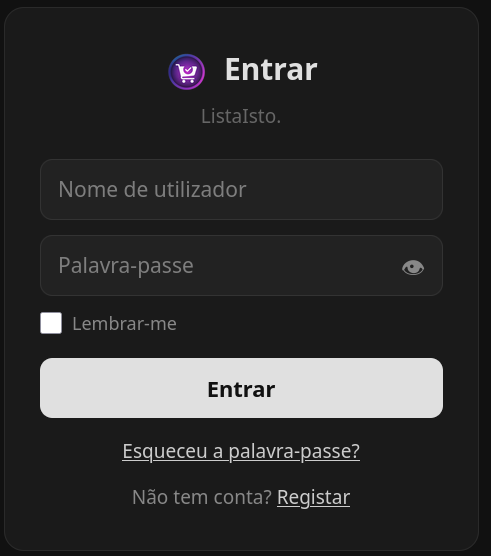

### Register
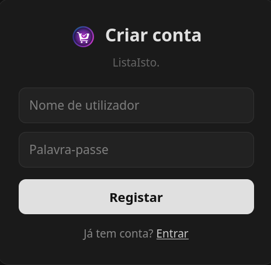

### Main View (Account)
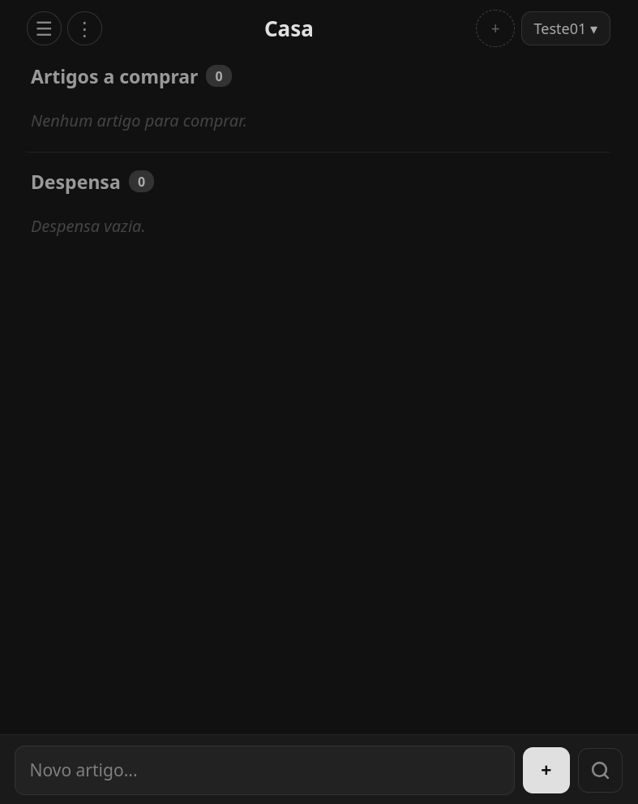

### List Options
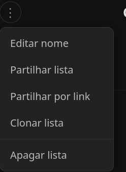

### Add List
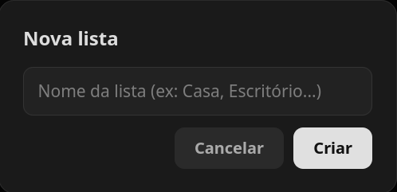

### Share List by Name
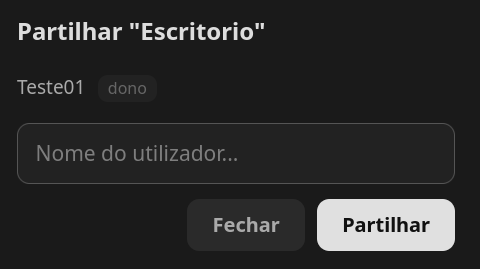

### Share List via Link
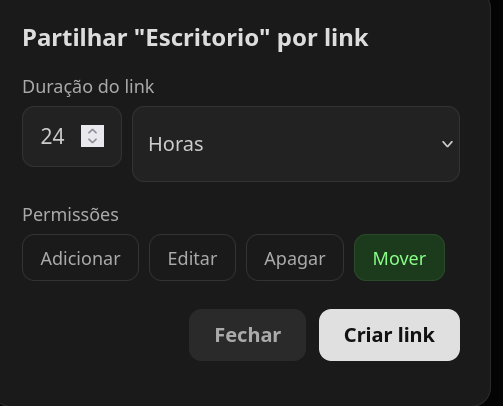

### Share Link — Copy Link
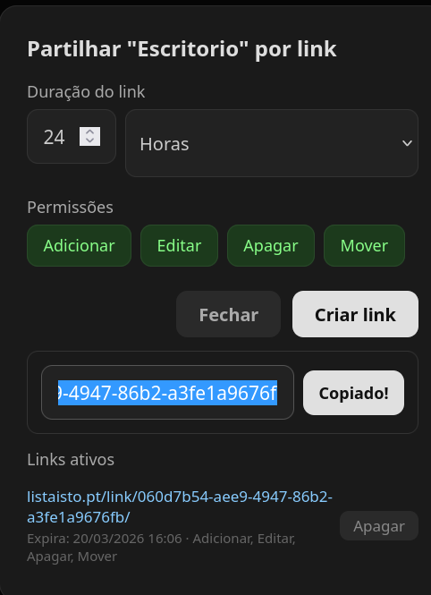

### Shared List (Public Link View)
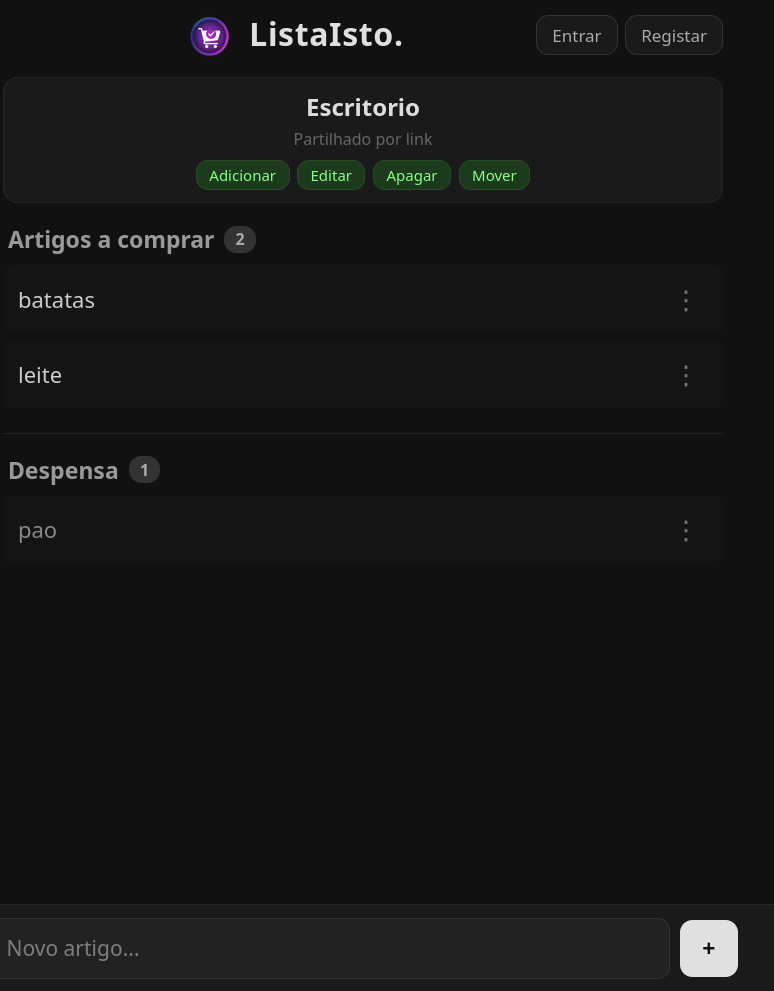

### Edit / Delete Item
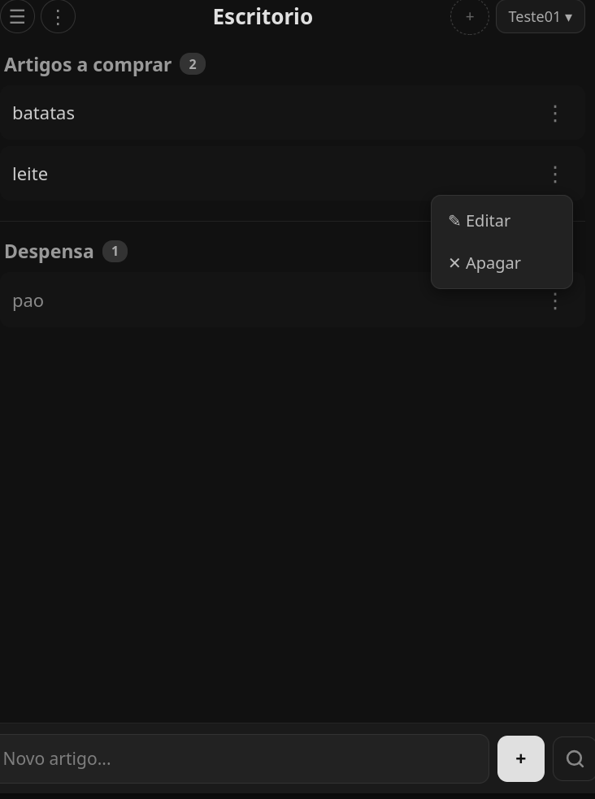

### Add / Search Item
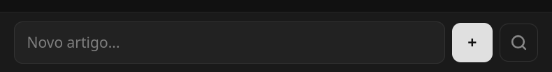

### Contacts & Logout Menu
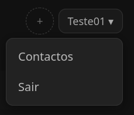

---

## Requirements

- Docker & Docker Compose
- A `.env` file (copy from `.env.example`) with database + SMTP credentials

---

## Project Structure

```
lista_compras/
├── frontend/                 # React + TypeScript + Vite SPA
│   ├── src/
│   │   ├── pages/            # Login, Register, AddEmail, Recover, ResetPassword, Home, PublicLink
│   │   ├── api.ts           # Typed client for /api/*
│   │   └── auth.tsx         # Auth context + route guards
│   └── package.json
├── rust_backend/             # Axum backend
│   ├── src/
│   │   ├── main.rs          # Router, sessions, startup (ensure_schema)
│   │   ├── db.rs            # sqlx queries + schema ownership
│   │   ├── handlers/        # /api/* + server-rendered handlers
│   │   ├── hashing.rs      # Django-compatible PBKDF2 + modern hashing
│   │   └── mailer.rs       # SMTP (lettre)
│   ├── Cargo.toml
│   └── Dockerfile
├── tests_e2e/                # Playwright end-to-end tests
├── Caddyfile                 # Reverse proxy + SPA serving
├── Dockerfile.caddy          # Builds the SPA and bakes it into Caddy
├── docker-compose.yml        # db + rust + caddy
├── .env.example              # Environment template
└── README.md
```

---

## Setup & Installation

### 1. Clone the repository

```bash
git clone <repo-url>
cd lista_compras/
```

### 2. Create a `.env` file

```bash
cp .env.example .env
# then edit DB_* and EMAIL_* with real values
```

### 3. Start the application

```bash
docker compose up -d --build
```

This starts three services:

- **db** — MariaDB
- **rust** — Axum backend (owns the schema; creates tables on first boot)
- **caddy** — reverse proxy serving the React SPA + `/api/*` over HTTPS

### 4. Access the app

- **Local:** http://localhost
- **Production:** https://your-domain.com (configured in `Caddyfile`)

User accounts are created through the in-app **Register** page; there is no
separate admin console.

---

## Data Models (tables)

| Table                    | Purpose                                                        |
|--------------------------|----------------------------------------------------------------|
| `auth_user`              | User accounts (id, username, password hash, flags)             |
| `user_email`             | App-owned email per user (decoupled from `auth_user.email`)    |
| `password_reset`         | Single-use, time-limited password-reset tokens                 |
| `compras_lista`          | Lists (`nome`, `dono_id`, `criado_em`)                         |
| `compras_artigo`         | Items (`nome`, `quantidade`, `comprar`, timestamps, `lista_id`)|
| `compras_listapartilha`  | List shared with a user (`lista_id`, `utilizador_id`)          |
| `compras_linkpartilha`   | Public share link (`token`, `expira_em`, permission flags)     |

Passwords are stored with a hash compatible with the legacy Django format and
are transparently upgraded on next login.

---

## Key API Routes (`/api/*`, JSON)

| Route                              | Method | Description                         |
|------------------------------------|--------|-------------------------------------|
| `/api/me`                          | GET    | Current session user                |
| `/api/register`                    | POST   | Create account                      |
| `/api/login`                       | POST   | Log in                              |
| `/api/logout`                      | POST   | Log out                             |
| `/api/email`                       | POST   | Associate an email                  |
| `/api/password/recover`            | POST   | Send a reset link by email          |
| `/api/password/reset`              | POST   | Set a new password with a token     |
| `/api/password/reset/:token`       | GET    | Validate a reset token              |
| `/api/password/change`             | POST   | Change password (logged in)         |
| `/api/lists`                       | GET/POST | List/create lists                 |
| `/api/lists/:id`                   | GET/DELETE | List detail / delete            |
| `/api/lists/:id/select`            | POST   | Switch active list                  |
| `/api/lists/:id/items`             | POST   | Add item                            |
| `/api/lists/:id/items/:iid`        | POST/DELETE | Edit / delete item             |
| `/api/lists/:id/items/:iid/toggle` | POST   | Move pantry ⇄ to-buy                |
| `/api/lists/:id/share`             | POST   | Share with a user                   |
| `/api/lists/:id/links`             | POST   | Create a public link                |
| `/api/public/:token`               | GET    | View a list via public link         |

---

## Tech Stack

- **Backend:** Rust — Axum, `sqlx` (MariaDB), `tower-sessions`, `lettre` (SMTP)
- **Frontend:** React + TypeScript, Vite, React Router
- **Database:** MariaDB 10.11
- **Containerization:** Docker, Docker Compose
- **Reverse proxy:** Caddy (automatic HTTPS)
- **Testing:** Playwright (`tests_e2e/`)

---

## Notes

- The quantity field accepts free text (e.g., `2`, `500g`, `1L`).
- Item names support accents, special characters, and emojis.
- Toggles send an explicit destination (`comprar`/`despensa`) so concurrent
  clicks by multiple users are idempotent.
- Emails live in the app-owned `user_email` table; existing emails are migrated
  out of `auth_user` automatically on first boot of the Rust backend.
- Password recovery sends a single-use link valid for one hour, built from
  `APP_BASE_URL`.
- The previous Django implementation is preserved on the `ListaCompras_django`
  branch.
